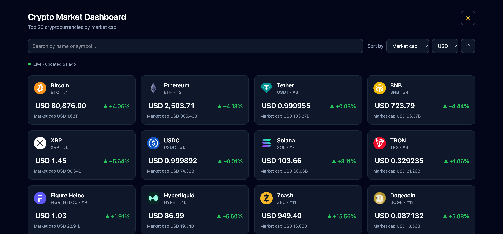

# Crypto Market Dashboard

A live market board for the top 20 cryptocurrencies by market cap.
React 19 · TypeScript · TanStack Query · Recharts · Tailwind 4.



## Setup

Requires Node 20 or newer. No API key or environment variables — the app calls
CoinGecko's free public API directly from the browser.

```bash
npm install
npm run dev      # http://localhost:5173
```

| Script | Purpose |
| --- | --- |
| `npm run dev` | Start the dev server |
| `npm run build` | Type-check and build for production |
| `npm run preview` | Serve the production build |
| `npm test` | Run the unit tests |
| `npm run lint` | Lint with oxlint |

## Features

- **Live board** — prices refresh every 60 seconds and flash green or red when
  they move.
- **Never blanks** — a failed refetch, a rate limit or a dropped connection
  degrades the status line instead of replacing the data. An error boundary
  covers render-time crashes, which the query layer cannot see.
- **Search and sort** — by name or symbol; by market cap, price or 24h change
  in either direction. State lives in the URL, so a view is shareable.
- **USD / AUD**, **light / dark**, and a **coin detail page** with a 7 day
  chart, hover readout and 24h high/low, market cap and volume.
- **Accessible** — price direction is carried by an arrow and a sign as well as
  colour, controls are labelled, and feed health is announced on change.

## Stack

| Choice | Why |
| --- | --- |
| **Vite + React + TypeScript** | No SSR requirement and no backend to justify a framework. |
| **TanStack Query** | Caching, retry, polling and offline pausing are most of this brief. |
| **React Router** | Two routes, plus `useSearchParams` for filter state. |
| **Recharts** | Axes, tooltip and resizing for the detail chart; lazy-loaded per route. |
| **Tailwind CSS v4** | Responsive grid and dark mode with no config file. |
| **Vitest** | Same toolchain as Vite. |

## Structure

```
src/
  components/   CoinCard, CoinGrid, Controls, FeedStatus, States,
                PriceChange, PriceChart, ThemeToggle, ErrorBoundary
  hooks/        useMarketsQuery, useMarketChartQuery, useFilterState,
                useIsOnline, usePriceTick
  routes/       CoinDetail
  shared/       ← no JSX, no hooks, no imports from above
    api/        CoinGecko endpoints
    constants/  every tuning knob, grouped by concern
    lib/        http (transport + ApiError), queryClient, format, filterSort
    types/      CoinMarket, MarketChart
```

## Decisions

The reasoning behind the parts that are not obvious — the poll interval, the
retry policy, why a failed refetch never unmounts the board, how money is
formatted, why the chart is split at the route — is in
**[docs/DECISIONS.md](docs/DECISIONS.md)**, along with what I would do next.

## Deploying

```bash
npx vercel        # or: npm run build && serve dist/
```

The app is a client-side SPA, so the host must rewrite unknown paths to
`index.html` — otherwise a deep link like `/coin/bitcoin` 404s on reload.
Vercel's Vite preset does this automatically; on a plain static host, add the
fallback yourself.
